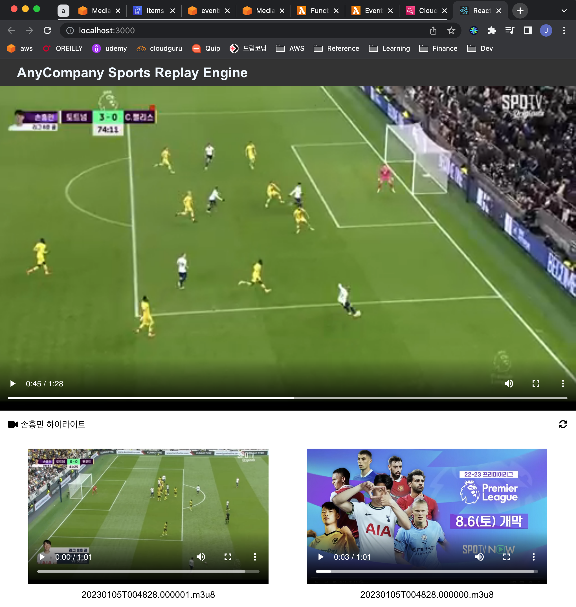
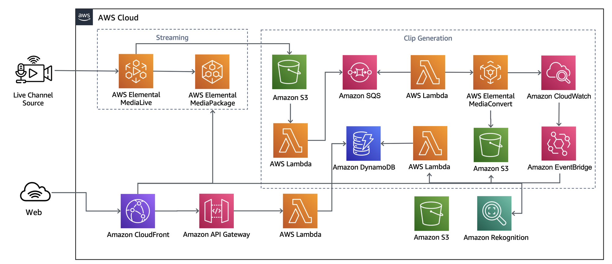
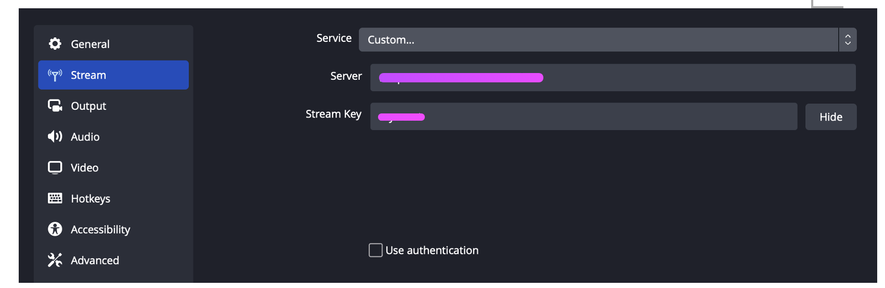
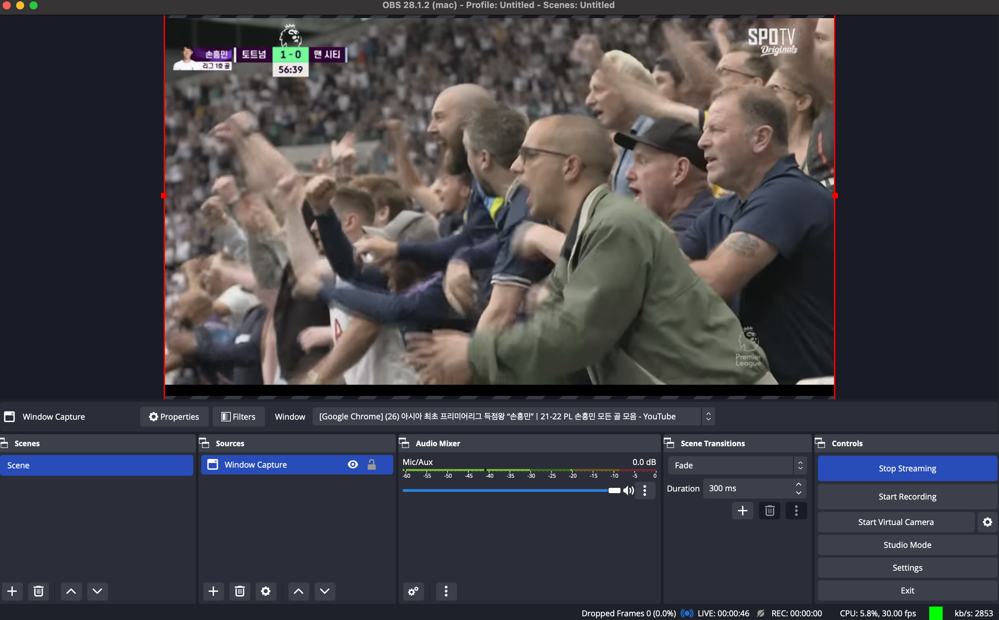

# Serverless Smart Media Streaming Engine with AI/ML Backend

## Overview

- Elemental Media Services for streaming and vod contents
- Serverless Event-Driven Architecture
- All infra-structure resources as a code using CDK
- Simple React frontend using Amplify
- All code written in typescript

This demo shows how you can use CDK and amplify to build a streaming service with a smart backend that analyze the streaming media using a AI/ML service. In this particular demo, it sends a soccer game that Tottenham plays, generate clips, and services only clips that Son Heung-min appears.



## Architecture



### Live Streaming

The streaming feature leverages Elemental Services. Amazon Elemental MediaLive provides live video processing service and Amazon Elemental MediaPackage provides packaging and distributions. And MediaPackage is integrated with the Amazon CloudFront to deliver live stream to viewers with low latency and high transfer speeds.

### VoD Generation Backend with Rekognition

This demo shows a good demonstration on how you can use various types of events when developing serverless architecture. Amazon Elemental MediaLive has two output groups, one for MediaPackage for live stream and another for S3 Archive. The S3 Archive output group archives live videos into S3 bucket which becomes the first event of Event-Driven Serverless backend.
When a media file is uploaded to S3 Archive Bucket, a lambda is invoked to put a message including the object information into SQS queue. Then another lambda is called via SQS target, to call Amazon Elemental MediaConvert to convert the file.
MediaConvert also has two output groups. One output group converts the file into HLS so it can be served as VoD Content. The other output group converts the file into MP4, because Amazon Rekognition can only analyze MP4 files.
Amazon EventBridge watches the jobs of MediaConvert, and it triggers an event when it completes and calls the third lambda. The third lambda calles Amazon Rekognition to analyze who appears in the video clip. And if a certain player is found ("Son Heung-min" in this demo), it puts the metadata in Amazon DynamoDB.

### Frontend Integration

For ease of configuration and deployment, this demo uses AWS Amplify for the frontend and AWS CDK for backend. To keep the infrastructure management simple and consistent, all the resources are defined and deployed using AWS CDK. And the resource information is exported into a file in JSON format, and the frontend imports that file to configure AWS Amplify resources. Detailed instruction will be provided in the later chapter.

## Prerequisites

- aws account
- aws-cli
- typescript >= 4.8
- aws-cdk >= 2.54
- node >= 16.17.0
- npm >= 8.15.0
- docker
- git

## Installation

1. Download the code

```sh
git clone https://github.com/atheanchu/MediaReplayEngine.git
```

2. Install Packages for CDK backend

```sh
npm install
```

3. Export AWS CLI

```sh
export AWS_PROFILE=<your aws account profile>
```

4. Bootstrap and synthesize CDK

```sh
cdk bootstrap
cdk synth
```

5. Deploy CDK - export the output to the output file in frontend directory.

```sh
cdk deploy -O ./frontend/cdk-exports.json
```

6. Install packages for frontend React application

```sh
cd ./frontend
npm install
```

## Testing the demo

1. Install [Open Broadcaster Software(OBS)](https://obsproject.com/ko/download)
2. Run OBS
3. Click Settings and Streams. Choose Custom for Service.
4. Copy `MyMediaLiveChannelDestPri` from `./frontend/cdk-exports.json`. The value must be in the format of `rtmp://<ip address>:<port>/<stream key>`. For Server, input `rtmp://<ip address>:<port>/` and for Stream Key, put `<stream key>`. For instance, if `MyMediaLiveChannelDestPri` is `rtmp://555.555.555.555:9999/streamkey`,

```
- Server: rtmp://555.555.555.555:9999/
- Stream Key: streamkey
```



5. Play a video that Son Heung-min is in. It could be a local file or youtube video.

6. From Source, click `+` button and choose Window Capture. Select the window you want to start streaming to MediaLive input and click the button `Start Streaming`
   

7. Run the frontend application

```sh
cd ./frontend
npm start
```

## Uninstall

- Run `cdk destroy` command

```sh
cdk destroy
```
